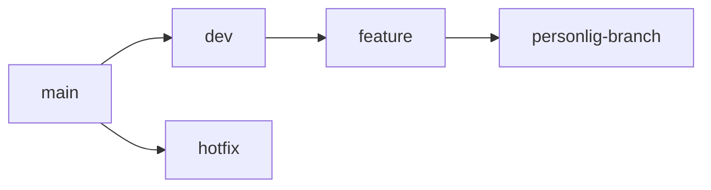
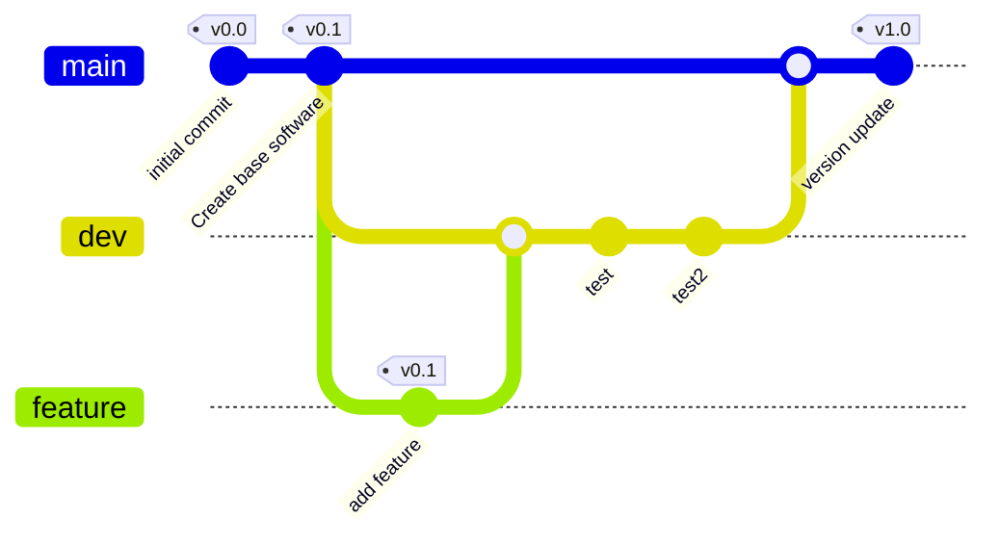

# Sep4

I dette projekt er der fokus, eller lavet et "tema", som drejer sig om drivhuse.  
Der bliver her kigget på hvordan et IoT device kan bruges i sådan en position.

Der er blevet fordelt 3 til 4 gruppe medlemmer ud på 3 teams.

# Github aftaler

## Branching

**Eksempel:**

## Merging

- Man laver pull requests og man committer aldrig direkte til main.
- Minimum én anden skal have lavet et review før man merger.
- Hvis et review ikke bliver godkendt, så er det op til den person som efterspurgte review at opdatere deres kode.
- Man opretter ikke en pull request hvis man ikke er helt færdig med sin opgave.

## Committing

1. Capitalization and Punctuation: Capitalize the first word and do not end in punctuation. If using Conventional Commits, remember to use all lowercase.

2. Mood: Use imperative mood in the subject line. Example – Add fix for dark mode toggle state. Imperative mood gives the tone you are giving an order or request.

3. Type of Commit: Specify the type of commit. It is recommended and can be even more beneficial to have a consistent set of words to describe your changes. 

``Example: Bugfix, Update, Refactor, Bump, and so on.``

4. Length: The first line should ideally be no longer than 50 characters, and the body should be restricted to 72 characters.

5. Content: Be direct, try to eliminate filler words and phrases in these sentences (examples: though, maybe, I think, kind of). Think like a journalist.

Disse blev fundet fra dette link: https://www.freecodecamp.org/news/how-to-write-better-git-commit-messages/

## Issues / Kanban cards / Arbejdsopgaver

- Userstories bliver arbejdsopgaver for sig selv.
- Den sidste der forlader en userstory har ansvar for at sætte den som done.
- Man tildeler sig selv den userstory man er på. (Muligvis laver teams?)
- Der bliver lavet issues ud fra userstories.
